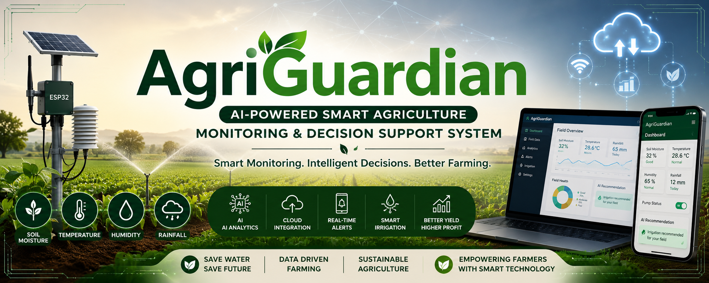

# 🌾 AgriGuardian



## AI-Powered Smart Agriculture Monitoring & Decision Support System

AgriGuardian is a smart farming solution designed to help farmers monitor field conditions, identify irrigation needs, and make better crop-management decisions using IoT sensors and artificial intelligence.

---

## 📌 Problem Statement

Farmers often face problems such as:

- Unnecessary water usage
- Lack of real-time soil information
- Delayed detection of crop stress
- Unpredictable weather conditions
- Limited access to timely agricultural guidance

These challenges can reduce crop productivity and increase farming costs.

---

## 💡 Proposed Solution

AgriGuardian continuously collects agricultural data using sensors installed in the field.

The system analyzes parameters such as:

- Soil moisture
- Temperature
- Humidity
- Rainfall conditions
- Environmental changes

Based on the collected data, the platform provides farmers with irrigation recommendations, alerts, and crop-management suggestions.

---

## 🎯 Objectives

- Monitor field conditions in real time
- Reduce unnecessary water consumption
- Support timely irrigation decisions
- Detect abnormal environmental conditions
- Improve crop productivity
- Promote sustainable farming practices

---

## ✨ Key Features

- Real-time soil moisture monitoring
- Temperature and humidity tracking
- Smart irrigation recommendation
- Water-pump automation
- Farmer alert notifications
- Cloud-based agricultural dashboard
- Historical field-data analysis
- Future AI-based crop disease detection

---

## 🔄 Working Process

1. Sensors collect field and environmental data.
2. The microcontroller processes the sensor readings.
3. Data is uploaded to the cloud platform.
4. The system analyzes the field condition.
5. Farmers receive recommendations and warning alerts.
6. The irrigation system can be activated when soil moisture becomes low.

---

## 🧰 Proposed Hardware

- ESP32 Microcontroller
- Soil Moisture Sensor
- DHT11 Temperature and Humidity Sensor
- Rain Sensor
- Water-Level Sensor
- Relay Module
- Water Pump
- Power Supply

---

## 💻 Proposed Software and Technologies

- Arduino IDE
- Embedded C / C++
- Firebase or Supabase
- HTML
- CSS
- JavaScript
- Python
- Artificial Intelligence
- Internet of Things

---

## 🏗️ Proposed System Architecture

```text
Field Sensors
      ↓
ESP32 Microcontroller
      ↓
Cloud Database
      ↓
Data Analysis and Decision Engine
      ↓
Farmer Dashboard and Mobile Alerts
      ↓
Smart Irrigation Control
```

## 🌱 Expected Benefits

- Saves water
- Reduces manual field monitoring
- Supports data-driven farming
- Improves irrigation efficiency
- Helps prevent crop stress
- Suitable for rural and small-scale farmers
- Low-cost and scalable solution

## 🚀 Future Scope

- AI-based crop disease identification
- Weather forecast integration
- Fertilizer recommendation
- Mobile application for farmers
- Multilingual voice guidance
- Drone-based crop monitoring
- Crop-yield prediction

## 📊 Project Status

**Current Stage:** Concept design and proposed prototype development.

## 👩‍💻 Developed By

**Kalaivani S**  
B.Tech Artificial Intelligence & Data Science  
Rathinam Technical Campus
